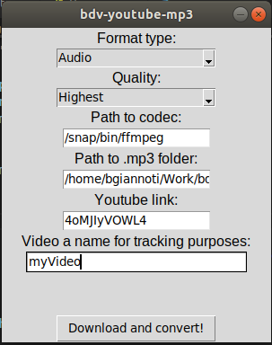

# bdv-youtube-mp3

Tool to download Youtube videos/audios and convert them to either .flv or .mp3 files.

## Description

This tool downloads the video or audio stream from the chosen Youtube video and saves it to your disk.


## Getting Started

### Dependencies

* Python3
* Node.js
* ffmpeg (Optional. Only required if you want the video converted to an audio-only .mp3 file)

### Installing

* Install Node and Python3 dependencies for the project to run.
```
$: npm i
```
```
$: pip install -r /path/to/requirements.txt
```

* Now you can either build it to an executable file or just run it from python3, like so:

```
$: python3 main.py
```

### How to use, types and file formats



The use is pretty straight-forward:

Fill the required fields and hit the bottom button. If you want the .mp3 audio conversion, then you need to provide the path to your ffmpeg installation.

You can get ffmpeg here: `https://www.ffmpeg.org/download.html`

You can queue as many videos as you want, since every Nodejs download is triggered in a different Python thread.


## Authors

Brunodev09 - Bruno Mayol Giannotti

## License

MIT
